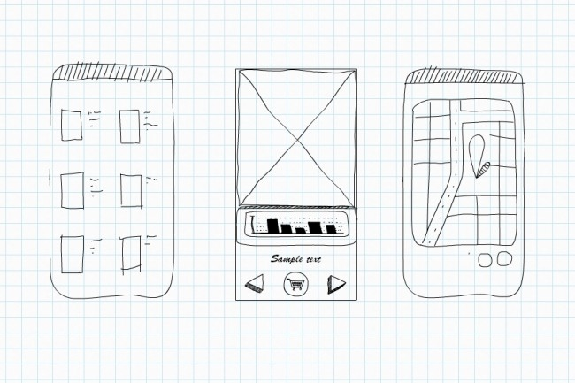
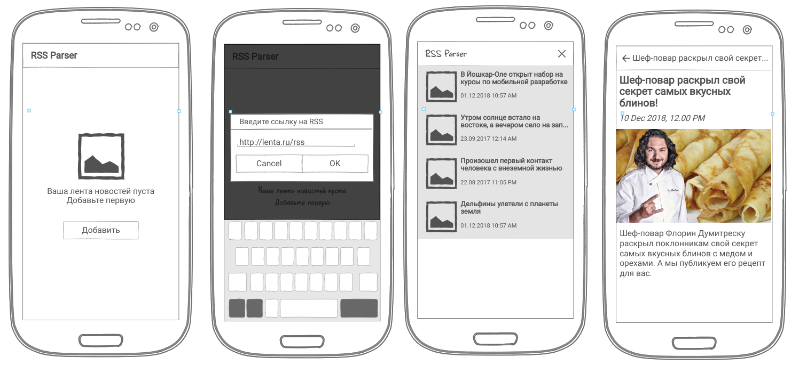
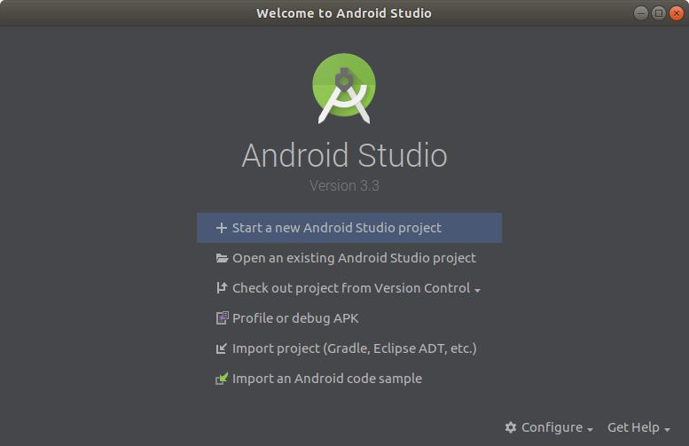
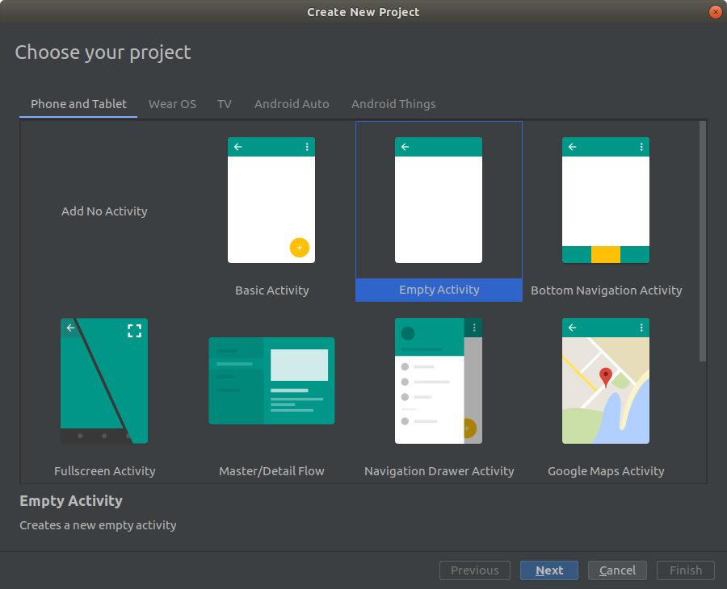
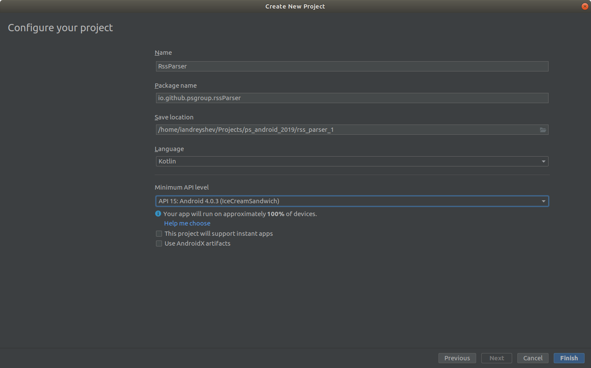
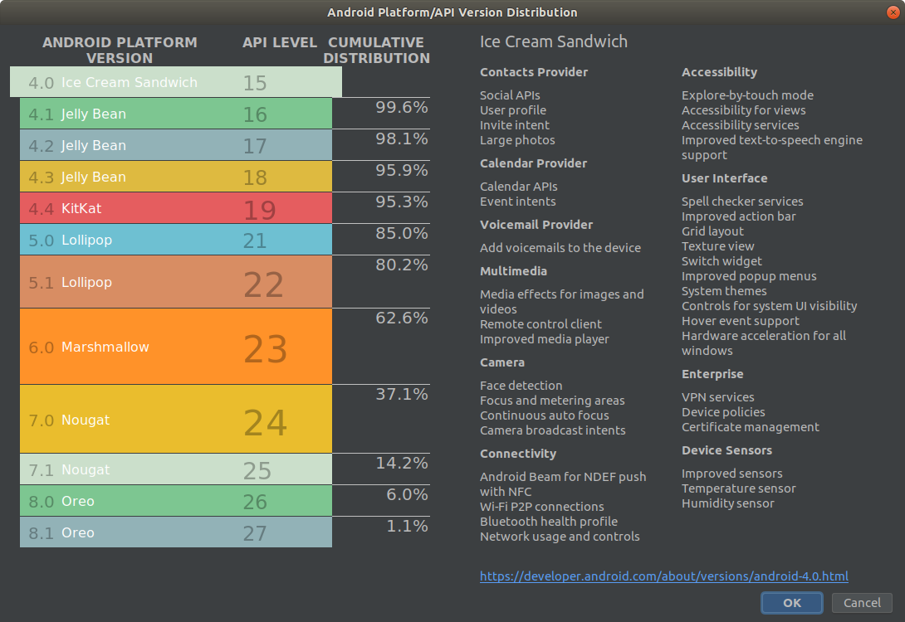
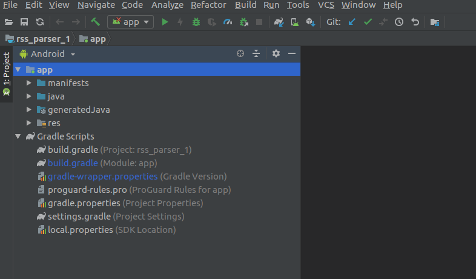
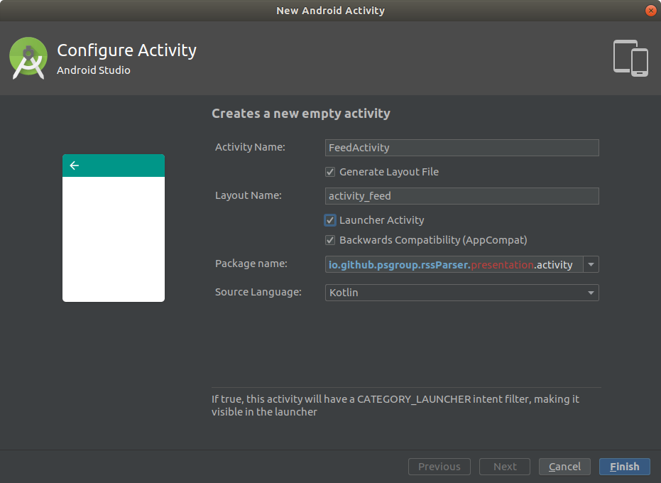
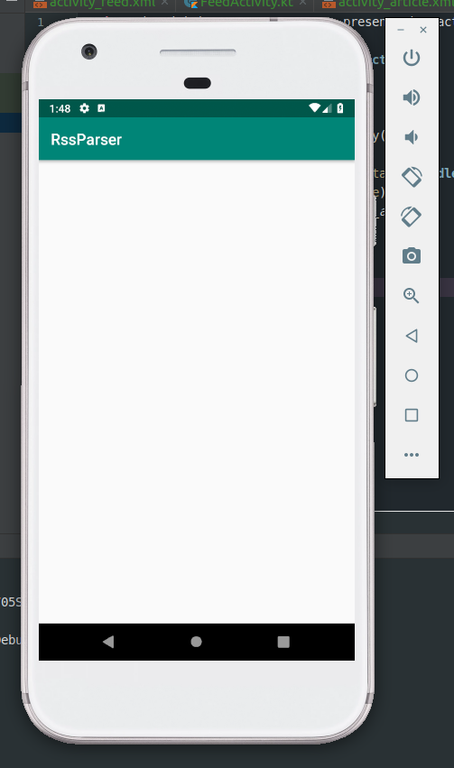

# 1. Разработка макета и создание проекта в Android Studio

## Этот пример содержит:

1. Разработка макета приложения
2. Создание проекта в Android Studio

### Макет приложения

#### Что такое макет приложения?
Макет приложения - это вариант дизайна вашего будущего приложения. Дизайн определяет внешний вид — то, на что в первую 
очередь обращает внимание пользователь. От дизайна во многом зависит общее восприятие информации, которую содержит 
приложение.

#### Как сделать макет приложения?

Можно взять в руки карандаш и листо бумаги и просто нарисовать от руки



Можно использовать сервисы для прототипирования и накидать макет  

Например, вот так будет выглядеть парсер, который мы создадим:



Сервисы для прототипирования:

* [MarvelApp](https://marvelapp.com/)
* [NinjaMock](https://ninjamock.com/) - был использован для макета парсера
* [Proto.io](https://proto.io/)
* [InVision](https://www.invisionapp.com/)

### Проект приложения в Android Studio

Для разработки приложения будем использовать Android Studio. 
Скачать ее можно с [официального сайта](https://developer.android.com/studio/)  

После запуска выберем **Start a new Android Studio project**



Не будем искать легких путей и создадим проект выбрав вариант "Add No Activity". 
Это означает, что IDE не будет автоматически создавать классы экранов, соответствующие им лейауты и добавлять их в
файл манифеста



После этого Android Studio предложит выбрать некоторые характеристики проекта. Например, вы можете определить
для каких операционных систем будет разрабатываться приложение  



Нажав на **Help me choose**, можно посмотреть статистику по использованию версий операционной системы, на момент
написания примера она выглядела так:



Выберем минимальную версию операционной системы 15, чтобы полностью охватить парк устройств  
Версии API можно изменять в ходе разработки проекта, в данный момент выбор не критичен  

После создания проекта, в панели слева можно увидеть его структуру. Существует несколько режимов просмотра,
на скриншоте выбран режим для просмотра Android проектов. Голубым отмечены директории исходного кода и отдельно
Gradle скрипты



#### Создадим классы Activity

Согласно макетам в приложении должно быть два экрана.

Выбираем в Android Studio:  
**File -> New -> Activity -> Empty Activity**

Откроется окно настройки активити  

* Поставим галочку напротив Generate Layout File, чтобы IDE создала файл разметки  
* Поставим галочку напротив Launcher Activity, чтобы IDE прописала активити как стартовое в манифесте приложения
* В Package name допишем presentation.activity, чтобы файл класса актипити был создан в директории presentation/activity



Должен создаться файл с классом FeedActivity на языке Kotlin и файл activity_feed.xml в директории res/layout.
Аналогично создадим ArticleActivity, в будущем она будет использоваться для просмотра отдельной новости.  

Если компилятор не может найти класс R, к которому происходит обращение в новом файле активити, то добавьте
в начало файла импорт:

```Kotlin
import io.github.psgroup.rssParser.R
```

Теперь можно запустить приложение на эмуляторе или реальном устройстве:  
**Run -> Run 'app'**



### Полезные материалы:  
[Официальный гайд по инструментам Android Studio](https://developer.android.com/studio/intro/)  

#### [Следующий пример >>](../rss_parser_2)