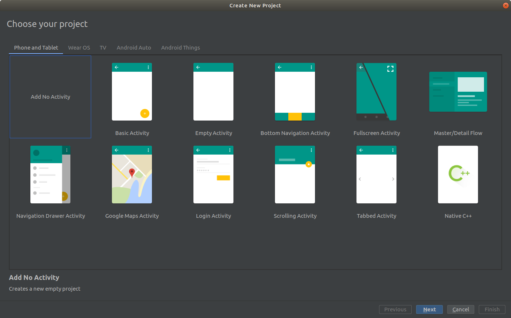

# 1. Создание первого экрана

##### Этот пример содержит:

1. Создание проекта в Android Studio
2. Верстка простого интерфейса
3. Обработка события по нажатию на кнопку

#### Создание проекта и верстка

Создадим проект выбрав шаблон "Empty Activity". Автоматически создастся проект, в котором имеется только один экран.



Код активити будет выглядеть примерно так:

```kotlin
class MainActivity : AppCompatActivity() {

    override fun onCreate(savedInstanceState: Bundle?) {
        super.onCreate(savedInstanceState)
        setContentView(R.layout.activity_main)
    }

}
```

Изменим верстку лейаута так, чтобы он содержал текстовое поле, кнопку и элемент отображающий текст.  

```xml
<?xml version="1.0" encoding="utf-8"?>
<android.support.constraint.ConstraintLayout xmlns:android="http://schemas.android.com/apk/res/android"
    xmlns:app="http://schemas.android.com/apk/res-auto"
    android:orientation="vertical"
    android:layout_width="match_parent"
    android:layout_height="match_parent">

    <TextView
        android:id="@+id/textRssXml"
        android:layout_width="match_parent"
        android:layout_height="0dp"
        android:textSize="30sp"
        app:layout_constraintBottom_toTopOf="@+id/constraintLayout"
        app:layout_constraintEnd_toEndOf="parent"
        app:layout_constraintStart_toStartOf="parent"
        app:layout_constraintTop_toTopOf="parent" />

    <android.support.constraint.ConstraintLayout
        android:id="@+id/constraintLayout"
        android:layout_width="match_parent"
        android:layout_height="wrap_content"
        android:orientation="horizontal"
        app:layout_constraintBottom_toBottomOf="parent"
        app:layout_constraintEnd_toEndOf="parent"
        app:layout_constraintStart_toStartOf="parent">

        <EditText
            android:id="@+id/textInputRssUrl"
            android:layout_width="0dp"
            android:layout_height="wrap_content"
            android:inputType="textUri"
            app:layout_constraintBottom_toBottomOf="@+id/btnFetchRss"
            app:layout_constraintEnd_toStartOf="@+id/btnFetchRss"
            app:layout_constraintStart_toStartOf="parent"
            app:layout_constraintTop_toTopOf="@+id/btnFetchRss" />

        <Button
            android:id="@+id/btnFetchRss"
            android:layout_width="wrap_content"
            android:layout_height="wrap_content"
            android:text="Fetch"
            app:layout_constraintBottom_toBottomOf="parent"
            app:layout_constraintEnd_toEndOf="parent"
            app:layout_constraintTop_toTopOf="parent" />

    </android.support.constraint.ConstraintLayout>

</android.support.constraint.ConstraintLayout>
```

#### Подписка на событие нажатия

Теперь подпишемся на нажатие кнопки, и сделаем отображение введенных в текстовое поле данных в элементе TextView.  

```kotlin
class MainActivity : AppCompatActivity() {

    private lateinit var mButton: Button
    private lateinit var mUrlInput: EditText
    private lateinit var mTextView: TextView

    override fun onCreate(savedInstanceState: Bundle?) {
        super.onCreate(savedInstanceState)
        setContentView(R.layout.activity_main)

        mButton = findViewById(R.id.btnFetchRss)
        mUrlInput = findViewById(R.id.textInputRssUrl);
        mTextView = findViewById(R.id.textRssXml)

        mButton.setOnClickListener {
            mTextView.text = mUrlInput.text.toString()
        }
    }

}
```

В примере используется стандартный для активити метод findViewById<T>(), чтобы обратиться к элементу UI. Такой подход
не безопасен, потому что нельзя во время компиляции опеределить сможет ли метод найти view по идентификатору.  
Подключим gradle-плагин [kotlin-android-extensions](https://kotlinlang.org/docs/tutorials/android-plugin.html) в build.gradle модуля app:

```groovy
apply plugin: 'kotlin-android-extensions'
```

Теперь можно обрааться к UI элементам без поиска через функцию findViewById<T>(). Если элемент будет убран из лейаута
или у него поменятся id, проект не пересоберется без исзменения кода активити. Такой подход позволяет находить
ошибки на стадии компиляции.

```kotlin
import kotlinx.android.synthetic.free.activity_free.*

class MainActivity : AppCompatActivity() {

    override fun onCreate(savedInstanceState: Bundle?) {
        super.onCreate(savedInstanceState)
        setContentView(R.layout.activity_main)

        btnFetchRss.setOnClickListener {
            textRssXml.text = textInputRssUrl.text.toString()
        }
    }

}
```

Запустим приложение на эмуляторе и посмотрим что получилось.
После ввода текста и нажатия на кнопку, текст появляется в элементе TextView.


Если повернуть устройство, то данные внутри TextView теряются пропадают.


Так происходит, потому что после переворота экран полностью пересоздается, подробнее об этом в следующем примере.

##### Полезные материалы:  
[Документация активити](https://developer.android.com/guide/components/activities?hl=ru)  

### [Следующий пример >>](../rss_parser_2)