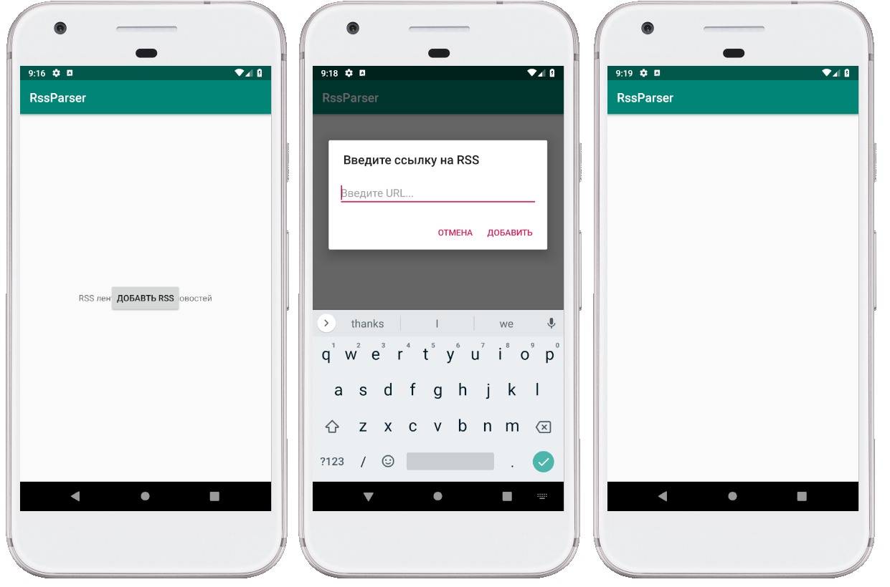
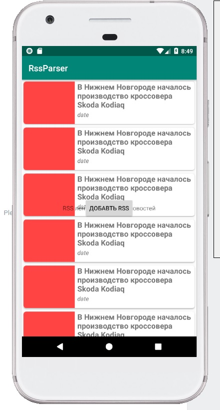

# 2. Простая верстка интерфейсов

## Этот пример содержит

1. Написание первой версии интерфейса
2. Оброботка событий ввода

### Интерфейс экрана новостей

Так как в предыдущем примере мы создавали файлы экранов через встроенную
функцию IDE, то xml-файлы разметки были автоматически сгенерированы. Стандартно
они создаются в директории **res/layout**.  

Разметка экрана с новостями (activity_feed.xml) выглядит так:

```xml
<?xml version="1.0" encoding="utf-8"?>
<android.support.constraint.ConstraintLayout
        xmlns:android="http://schemas.android.com/apk/res/android"
        xmlns:tools="http://schemas.android.com/tools"
        android:layout_width="match_parent"
        android:layout_height="match_parent"
        tools:context=".presentation.activity.FeedActivity">

</android.support.constraint.ConstraintLayout>
```

В нем содержится только корневой элемент ConstrainLayout. Так как наш
интерфейс не содержит большого количества вложенных элементов, заменим его на FrameLayout и добавим остальные необходимые элементы согласно макетам.
Получится такой xml-файл:

```xml
<?xml version="1.0" encoding="utf-8"?>
<FrameLayout xmlns:android="http://schemas.android.com/apk/res/android"
    android:layout_width="match_parent"
    android:layout_height="match_parent"
    android:orientation="vertical">

    <android.support.v7.widget.RecyclerView
        android:id="@+id/newsList"
        android:layout_width="match_parent"
        android:layout_height="match_parent" />

    <Button
        android:id="@+id/addRssButton"
        android:layout_width="wrap_content"
        android:layout_height="wrap_content"
        android:layout_gravity="center"
        android:text="Добавть RSS" />

    <TextView
        android:id="@+id/emptyListText"
        android:layout_width="wrap_content"
        android:layout_height="wrap_content"
        android:layout_gravity="center"
        android:text="RSS лента не содержит новостей" />

</FrameLayout>
```

Кнопку **addRssButton** будем показывать когда пользователь не ввел ссылку на
RSS ленту, а текст **emptyListText** будем показывать, когда ссылка на RSS
введена, но список новостей пуст.

### Обработка событий ввода

Теперь сделаем так, чтобы по нажатию на кнопку **addRssButton** на окне
появлялось диалоговое окно с полем ввода ссылки на RSS. Для этого используем
класс - [Alert Dialog](https://developer.android.com/guide/topics/ui/dialogs?hl=ru)
  
К сожалению, Alert Dialog не умеет автоматически вставлять поле ввода текста,
по-этому придется создать ещё один лейаут с полем ввода **dialog_input_field.xml**

```xml
<?xml version="1.0" encoding="utf-8"?>
<FrameLayout xmlns:android="http://schemas.android.com/apk/res/android"
    android:layout_width="match_parent"
    android:layout_height="match_parent">

    <EditText
        android:id="@+id/rssUrl"
        android:layout_width="match_parent"
        android:layout_height="wrap_content"
        android:layout_marginStart="16dp"
        android:layout_marginTop="19dp"
        android:layout_marginEnd="16dp"
        android:layout_marginBottom="14dp"
        android:hint="Введите URL..."
        android:inputType="textUri" />

</FrameLayout>
```

В методе onCreate(Bundle) внутри FeedActivity подпишемся на событие
нажатия кнопки **addRssButton**. После нажатия кнопки будет происходить
создание и открытие диалога ввода ссылки. Чтобы убедиться в работоспособности
 диалога, добавим переход на другое активити после нажатия кнопки **Добавить**

```Kotlin
    override fun onCreate(savedInstanceState: Bundle?) {
        ...
        addRssButton.setOnClickListener {
            openUrlDialog()
        }
    }

    private fun openUrlDialog() {
        AlertDialog.Builder(this)
                .setTitle("Введите ссылку на RSS")
                .setPositiveButton("Добавить") { dialog, buttonId ->
                    startActivity(Intent(this, ArticleActivity::class.java))
                }
                .setNegativeButton("Отмена") { dialog, buttonId -> }
                .setView(R.layout.dialog_input_field)
                .show()
    }
```

Запустим приложение и посмотрим, что получилось



Если вы откроете диалог и начнете переворачивать экран, то заметите, что он
пропадает. Причем, если зайти в Logcat, то можно увидеть лог об ошибке Window Leak. Чтобы избежать утечек, необходимо закрывать окно, после уничтожения экрана в методе **onDestroy()**.

```kotlin
private var mUrlDialog: AlertDialog? = null

private fun openUrlDialog() {
    mUrlDialog = AlertDialog.Builder(this)
            // other code
}

override fun onDestroy() {
    super.onDestroy()
    mUrlDialog?.dismiss()
}
```

В следующем примере мы добавим сохранение состояние экрана после
переворота.

### Адаптер списка новостей

Для отображения данных в списке RecyclerView используется паттерн Адаптер. Для элемента интерфейса RecycleView можно указать адаптер, который будет создавать и настраивать элементы списка для визуализации.

1. Создадим класс **ArticleViewHolder**, который унаследован от класса **RecyclerView.ViewHolder**. Этот класс будет получать **View**, который можно настраивать для визуализации новости из списка.
2. Создадим класс **ArticlesAdapter**, который унаследован от класса **RecyclerView.Adapter\<ArticleViewHolder\>**. Этот класс будет заниматься созданием и настройкой **ArticleViewHolder**.

```kotlin
class ArticleViewHolder(view: View) : RecyclerView.ViewHolder(view)

class ArticlesAdapter : RecyclerView.Adapter<ArticleViewHolder>() {

    override fun onCreateViewHolder(parent: ViewGroup, position: Int): ArticleViewHolder =
        LayoutInflater.from(parent.context)
            .inflate(R.layout.item_article, parent, false)
            .let { view -> ArticleViewHolder(view) }

    override fun onBindViewHolder(viewHolder: ArticleViewHolder, position: Int) = Unit

    override fun getItemCount(): Int = 100

}
```

Сейчас **RecyclerView**, получивший ArticlesAdapter, станет отображать в списке 100 элементов, при этом макет каждого элемента будет создаваться из файла **item_article.xml** (см. метод **onCreateViewHolder**).

Сделаем экземпляр **ArticlesAdapter** адаптером списка новостей в **FeedActivity**

```kotlin
private val mArticlesAdapter = ArticlesAdapter()

// Вызывается внутри метода onCreate
private fun initArticlesList() {
    newsList.layoutManager = LinearLayoutManager(this)
    newsList.adapter = mArticlesAdapter
}
```



В следующем примере добавим абстракцию ViewModel для хранения состояния экрана.

### Полезные материалы

[Документация по макетам](https://developer.android.com/guide/topics/ui/declaring-layout)  
[Гайд про диалоговые окна](https://developer.android.com/guide/topics/ui/dialogs?hl=ru)

#### [<< Предыдущий пример](../rss_parser_1) / [Следующий пример >>](../rss_parser_3)