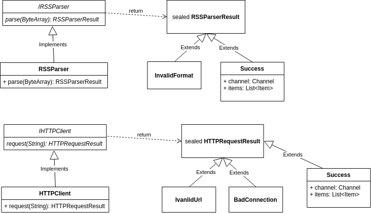

# 2. Жизненный цикл экранов

##### Этот пример содержит:
1. Сохранение состояния активити после изменения конфигурации
3. Написание иерархии классов парсера

#### Сохранение примитивных данных
Одной из главных проблем, с которой сталкивается разработчик при написании приложения на Android - все пересоздается
после переворота экрана (и не только).

Как указано [в документации](https://developer.android.com/guide/components/activities?hl=ru#Lifecycle), существует API
обратных вызовов, с которыми у разработчика есть возможность сохранить и восстановить некоторые данные посредством
переопределения метода onSaveInstantState(Bundle).

Давайте напишем сохранение данных, которые отображаются в TextView после нажатия кнопки:

```kotlin
class MainActivity : AppCompatActivity() {

    override fun onCreate(savedInstanceState: Bundle?) {
        super.onCreate(savedInstanceState)
        setContentView(R.layout.activity_main)

        btnFetchRss.setOnClickListener {
            textRssXml.text = textInputRssUrl.text.toString()
        }
    }

    override fun onSaveInstanceState(outState: Bundle?) {
        super.onSaveInstanceState(outState)
        outState?.putString("text_key", textRssXml.text.toString())
    }

    override fun onRestoreInstanceState(savedInstanceState: Bundle?) {
        super.onRestoreInstanceState(savedInstanceState)
        textRssXml.text = savedInstanceState?.getString("text_key") ?: ""
    }

}
```

Метод onSavedInstantState(Bundle) будет вызван перед уничтожением активити. Запишем в Bundle текст по ключу "text_key",
а затем в методе onRestoreInstanceState(Bundle) возьмем из Bundle записаное значение.

Bundle - это потокобезопасная оболочка над классом ArrayMap, упрощаяющая работу с ним. Bundle хранит только примитивные
типы и Parcelable (структура состоящая только из примитивных типов), что позволяет передавать его между активити,
потоками и процессами.

Подробнее о том что такое Bundle можено почитать [здесь](https://developer.android.com/guide/components/activities/parcelables-and-bundles).

#### Сохранение сложных объектов
Bundle позволяет сохранять только примитивные типы или классы реализующие интерфейсы Serializable или
Parcelable. У нас не получится сохранить, например, класс из сторонней библиотеки, который не реализует ни один
из этих интерфейсовю, так как не можем переписать её код.  

Существует несколько способов решения этой проблемы, вот некоторые из них:
1. Хранить данные в Application-классе  
2. Использовать Retain Fragment для хранения данных
3. Использовать Service для хранения данных
4. Использовать библиотеку ViewModel из набора Android Jetpack

TODO: Рассказать про Retain Fragment и ViewModel  
TODO: Рассказать зачем иногда нужен Bundle

#### Иерархия классов парсера

Опишем интерфейсы классов парсера и Http-клиента для получения xml новостной летны из сети.



Для реализации RSSParserResult и HTTPRequestResult воспользуемся [изолированными классами](https://kotlinlang.ru/docs/reference/sealed-classes.html).
Такой класс обеспечивает ограниченное количество наследников и каждый из них может иметь состояние. В случае c
HTTP-клиентом мы сможем легко понять, произошла ли какая-то ошибка в ходе получения данных, а если нет, то возьмем
результат запроса в виде rss-канала и списка новостей.

Классы канала и новостей будут иметь такую структуру:

```kotlin
class Channel(
    val title: String,
    val description: String,
    val link: String,
    val imageUrl: String?
)

class Item(
    val title: String?,
    val description: String?,
    val postDate: String?,
    val imageUrl: String?
)
```

##### Полезные материалы:  
TODO 

### [Следующий пример >>](../rss_parser_3)